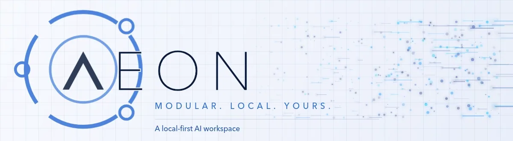

<p align="center">
  <picture>
    <source media="(prefers-reduced-motion: reduce)" srcset="public/brand/aeon-banner.png">
    
  </picture>
</p>

# AEON

**A local-first AI workspace built from governed blocks.** Runs on your computer. Your documents and keys stay on it; nothing syncs to a cloud unless you connect your own. What does reach the internet, only when you ask: web search (DuckDuckGo with no key), model and runtime downloads (Hugging Face, GitHub), and Deep Research's archive lookups.

> Think Linux, for the AI era: a kernel that discovers self-contained blocks, a nervous system (Settings) every block reports to, a vault that encrypts your keys, a Second Brain that indexes your files and answers with sources, and one LLM layer that routes every AI call by role.

<sub>**Measured 2026-09-14 on macOS, after the stale-file sweep** · 1,560 passing and 1 skipped (a real-PowerShell test that runs only on Windows) of 1,561 tests across 135 files · 17 blocks (plus two `_` scaffolds the kernel skips) · 5 CI legs (Windows · Ubuntu on Node 24 · Ubuntu on the Node 22.13 floor · macOS · security) · 0 undeclared block filesystem access. Every number here is a dated reading, not a property — see [Engineering standard](docs/ENGINEERING_STANDARD.md).</sub>

---

## Start in 2 minutes (no technical skills needed)

1. **Install Node.js** (one time): [nodejs.org](https://nodejs.org) → big green **LTS** button → install with all defaults.
2. **Download AEON**: the latest [release](https://github.com/cgomez1365/AEON/releases), or green **Code** button above → **Download ZIP** → unzip anywhere (Desktop is fine).
3. **Launch it**:
   - **Windows** — double-click `LAUNCH.bat`
   - **macOS** — double-click `launch.command`
   - **Linux** — run `./launch.sh`

**After the first launch, AEON puts its own icon on your Desktop** (`AEON.app` on macOS, an `AEON` shortcut on Windows). Open AEON from there from then on — every open also picks up any new files in your Vault. Don't want the icon? Delete it and it stays gone (`node launch.js --desktop-icon` brings it back), or set `AEON_NO_DESKTOP_ICON=1`. USB/portable installs never create one.

**Where your data lives:** everything AEON keeps for you — your Vault, downloaded models, API keys, settings and logs — goes into one folder in your home directory, `~/AEON` (`C:\Users\<you>\AEON` on Windows), never into the AEON folder itself. Reinstalling or updating AEON is therefore safe: delete the AEON folder, unzip a new one (or `git pull`), launch, and everything is still there. An install from before this change moves its data into `~/AEON` on the next launch, once, and tells you what it moved. To put the home somewhere else, set `AEON_HOME` in your environment before launching.

The launcher checks your computer, walks you through setup, and opens AEON in your browser. **Every setup question in the launcher can be skipped by pressing Enter** — you can finish everything later inside AEON under **Settings**. The one exception is before the launcher: if Node.js is missing, the wrapper asks to install it, and Enter means No and exits so you can install it yourself.

### Platform support, stated precisely

We do not say "cross-platform" and leave you to find out. Here is exactly what has been run, and where:

| Platform | Status | Evidence |
|---|---|---|
| **Windows** | Developed and released here | `LAUNCH.bat` run end-to-end continuously; CI leg on every push; the Desktop shortcut is created and read back through real PowerShell on the Windows CI leg |
| **macOS** | **Verified on real hardware** | 2026-08-12, a MacBook Pro that had never run AEON: `git clone` + `launch.command`, a local model installed, and it **answered with Wi-Fi off**. 2026-09-13: opening the Desktop icon started AEON in 5 s and indexed the Vault 24 s in. CI leg on every push |
| **Linux** | **Verified on a clean machine** | 2026-08-08, clean Ubuntu 24.04 with no Node: `launch.sh` offered to install Node via NodeSource (that day's LTS, 24.19.0; needs `curl`, `sudo` and apt, dnf or pacman) and booted AEON. CI legs on Ubuntu with Node 24 and with the Node 22.13 floor. No Desktop icon on Linux yet — the launcher says so |

**Known friction, not hidden:** a ZIP downloaded from a browser on macOS loses the executable bit and gains Gatekeeper's quarantine flag, so `launch.command` may refuse to open the first time. If you hit it: open Terminal, type `chmod +x `, drag the file in, press Enter. After that first launch, use the Desktop icon, which AEON builds on your own machine.

**Not yet verified:** a clean *Windows* machine that has never had Node. Everything else on this table has been done on real hardware or on a CI runner, as stated.

### Free AI, two ways
- **Cloud (free keys)** — grab a free key from [aistudio.google.com](https://aistudio.google.com) (Gemini) or [console.groq.com](https://console.groq.com) (Groq). Paste it when the launcher asks on first run, or later under **Settings**.
- **Local (no keys, fully private)** — open the **Cookbook** block, install the local runtime, download a model with one click. Models run inside AEON on a llama.cpp worker that the Cookbook downloads (a pinned, hash-verified release) into `~/AEON/data` — nothing is installed system-wide, nothing lands in the AEON folder, and no internet is needed after the download.

---

## Why this is not a weekend AI project

Plenty of things look like this from the outside. The difference is what happens *before* a change ships.

### Every claim in the product must be true of the product

Not of the design. A declaration with no consumer is not a feature; a badge that reads `Connected` from configuration while a probe reads `Failed` is a lie the product is telling. This is written down as a rule, and violations are treated as defects. → [`docs/CLAIM_DISCIPLINE.md`](docs/CLAIM_DISCIPLINE.md)

That rule applies to this README and to the docs: every file path, link and anchor they cite is checked to exist by a test, because a reference that carries stale facts teaches people to distrust all of it.

### Standing gates, cleared on every push

Suite, release gate, dependency audit, build, five CI legs, empty-shell boot, clean-room isolation, route collision, command collision, manifest freshness, declared filesystem surface, tree integrity, manifest read safety, scaffold invariant, launcher contract, docs truth. A gate skipped once stops being a gate. → [Engineering standard](docs/ENGINEERING_STANDARD.md)

### "Done" requires evidence, named

Each criterion is closed by a specific artifact rather than an assertion that it works — including *a local model installs and answers on a machine that never had AEON*, closed on clean physical hardware with the network off.

### Deletion has a protocol

Prove it dead, add the gate **before** the deletion, one scoped commit, then drive the real surface. That last step exists because every gate written before 2026-08-03 checked that something dangerous was *absent* and not one checked that the feature still *worked*.

### The failures are written down

Not the wins — the failures, with mechanisms. A test suite that passed because the machine had no credentials. A gate whose regex made it unable to fail. A `readManifest()` that returned the same value for *file missing* and *file unreadable*, so a transient read error was silently converted into a destructive write. An index panel that said "embedded 0" while every document had a vector. Each one is recorded so it costs full price only once. → [Engineering standard](docs/ENGINEERING_STANDARD.md#4-lessons-paid-for)

### The honest limit

**Blocks share a Node process.** The manifest describes what a block *should* do and governs what the kernel injects into it — it is **not** a sandbox against hostile code. That is fine while you install your own blocks, and it is a hard prerequisite before anyone else's. It is why the block store is gated rather than opened: the install endpoint exists and every cartridge, including one fetched from a URL, runs through the same untrusted-source pipeline (gate → staging → lint → approval), but no public catalog is published, and the endpoint is only as protected as the global guard, which is off until you create a login.

---

## What's inside

| Part | What it does |
|------|--------------|
| **Terminal** | Talk to AEON in plain English. `/` commands and drag-and-drop files. |
| **Aeon Matrix** | Your documents as a living 3D knowledge graph. Ask with sources, search, and an **Index** tab showing exactly what is embedded. |
| **Second Brain** | Your Vault is indexed on every launch and nightly at 3 AM; recall answers only from what it finds, and says so when nothing matches. |
| **Vault** | Everything you save, with a suggested home for every file you drop in. Lives in `~/AEON/Vault`, outside the install, so a reinstall never touches it. API keys encrypted (AES-256-GCM). |
| **Cookbook** | Download and manage local AI models. Probes your hardware, recommends what fits. |
| **Settings** | The nervous system. Every block declares its needs here; everything is configured in one place. |
| **Blocks** | Dashboard, Council, Deep Research, Files, Fleet Control, Memory Core, Orion Search, Security, Writer, and more — each a self-contained cartridge. → [`docs/BLOCKS.md`](docs/BLOCKS.md) |

### Terminal
- `/open matrix` — open any block by name (`/open` alone lists them)
- `/model` — hotswap the chat model from a picker, grouped by which keys you have
- `/model-pull qwen3-1.7b-q8` — download a local model from the curated catalog
- `/ask` — answer from your Vault, with citations; `/recall` — the matching passages themselves. Nothing found means no answer, and it says so.
- `/upload` or **drop a file onto the terminal** — AEON reads it, recommends where it belongs in your Vault, and indexes it there (PDF, HTML, Markdown, text, CSV and JSON; images and Word files are refused with a reason)
- `/help` — every command, with its usage line

Every command either works or fails with a named cause. There is no third outcome, and that is enforced: one command, one outcome, and a failure narrated as success is discarded rather than shown.

---

## Build your own block

A block is a folder. Drop it in `src/blocks/`, restart, it's live — nav, routes, and settings wire themselves from one file:

```
src/blocks/my_block/
  block.manifest.json   ← the DNA: identity, permissions, commands, settings
  index.jsx             ← the UI (default-exported React component)
  api/*.cjs             ← optional Express routes; every non-underscore file here is mounted by the kernel
```

Nothing about a block is hardcoded anywhere else. Copy `src/blocks/_template/` to start (routes are optional — see `src/blocks/_template/api/README.md`), and run `npm run aeon -- lint my_block` before you share it.

The manifest is not documentation — it is the source of truth the kernel reads at boot, and gates check it against the code. A route your manifest declares but your code does not serve fails the build: `npm run build` checks the route table and stops on drift, and `npm run prep:routes` regenerates it. → [`docs/BLOCK_STANDARD.md`](docs/BLOCK_STANDARD.md)

---

## Security model

- **Keys are encrypted into the vault and are never returned by the API.** AES-256-GCM; Settings sees only *configured / missing / vault* status. The one exception is your own credential backup under Settings, a deliberate, session-gated download of `.env` and the keyslots. The master key (`~/AEON/.env`) and the keyslots (`~/AEON/secrets`) are two halves — both live under `~/AEON`; move both or neither.
- **The vault refuses to overwrite itself.** A first-run guard that mints a fresh master key over an existing vault destroys access to everything in it. AEON refuses, names both halves, and points at your recovery code — and stays running, because you need the server in order to recover.
- **Block API routes are auth-gated at mount** from the manifest, fail-closed, and enforced whether or not the global guard is on. Before a login exists the gate is a pass-through by design.
- **Filesystem access beyond a block's own namespace is declared and audited.** 23 declarations, each naming the file, a scope, and a reason a reader can check. Undeclared access: **0**, enforced by a gate.
- **No caller-supplied string reaches a shell.** Operator-facing OS actions are named operations with fixed executables and argument arrays, and the terminal's `>` verb is retired. Two internal housekeeping calls still run constant strings through a shell (port reclaim on a busy port, the FFmpeg reaper), and Cookbook's session-gated model serve and download hand validated arguments to a Python or Node interpreter — an operator-only surface, not a shell.
- **No telemetry, no phone-home.** Broken Gear Industries runs zero servers on your behalf and receives nothing. Outbound traffic goes only to services you configure or trigger (model providers, your own Supabase or Firebase project, Hugging Face and GitHub for downloads, DuckDuckGo and archive.org during research). Firebase Analytics, if you configure Firebase, reports to your project and can be switched off.
- **Not claimed:** process isolation between blocks. See *The honest limit* above.

Found a vulnerability? Report it privately — see the [security policy](.github/SECURITY.md).

→ [`docs/SECURITY.md`](docs/SECURITY.md) · [`docs/DISASTER_RECOVERY.md`](docs/DISASTER_RECOVERY.md)

---

## For developers

```bash
npm ci
npm start               # vite dev server + kernel (hot reload)
npm run build           # production frontend → dist/
npm run server          # kernel only, serves dist/ at :3001
npm test                # vitest — 1,561 tests (2026-09-14)
npm run scan:release-gate   # runtime purity · path authority · cloud ratchet · block filesystem
npm run scan:audit          # no unreviewed high/critical advisories
```

Install, test, release gate and build run in CI on every push across four OS/Node legs; the dependency audit runs on a fifth (security) leg. `npm start` and `npm run server` are dev entry points and are not exercised by CI. Contributions follow the [contributing guide](.github/CONTRIBUTING.md).

**Documentation:** [Architecture](docs/ARCHITECTURE.md) · [Kernel](docs/KERNEL.md) · [Blocks](docs/BLOCKS.md) · [Block standard](docs/BLOCK_STANDARD.md) · [Memory architecture](docs/MEMORY_ARCHITECTURE.md) · [Engineering standard](docs/ENGINEERING_STANDARD.md) · [Claim discipline](docs/CLAIM_DISCIPLINE.md) · [Security](docs/SECURITY.md) · [Deployment](docs/DEPLOYMENT.md)

---

## Lineage

This AEON is the fourth generation. Two full rewrites, one hardening fork, one fusion. Almost no code survived between generations; the *ideas* did: the manifest (Gen 2), React (Gen 1), the operator account and kernel (v3x). What that history bought is the reason the gates above exist — each one is a defect that shipped once.

## License

[AEON Community License](LICENSE) — free to use and modify; no resale or redistribution. See [Terms of Use](TERMS_OF_USE.md).

---
*Broken Gear Industries · Build anything. Run anywhere.*
