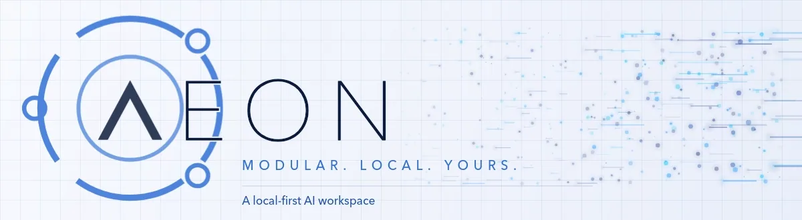
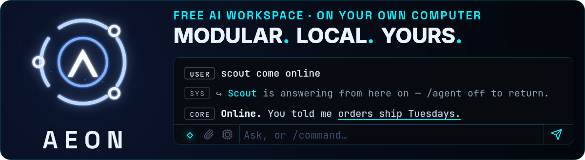
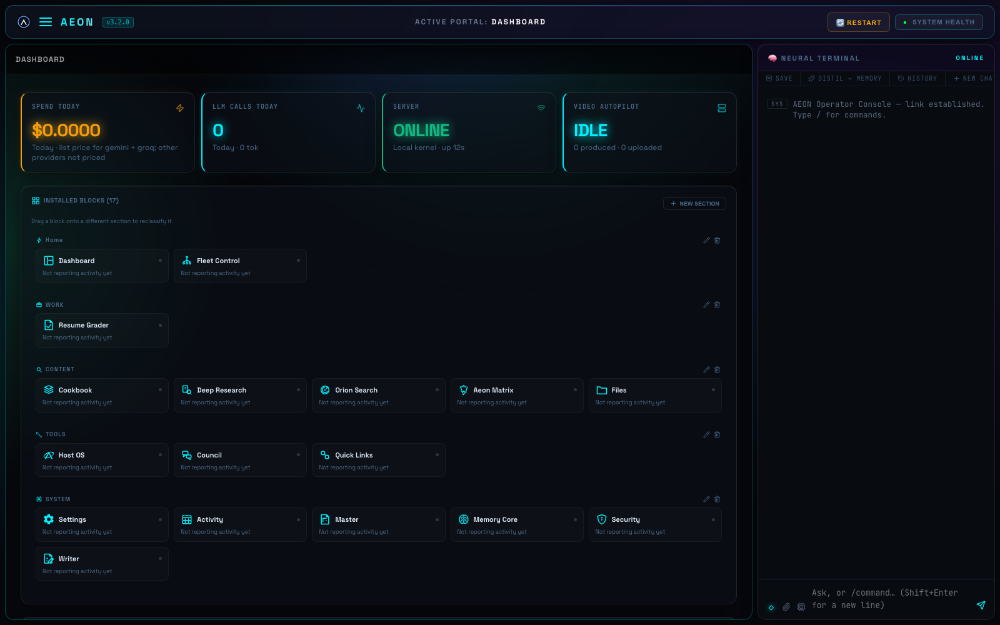

<p align="center">
  <picture>
    <source media="(prefers-reduced-motion: reduce)" srcset=".github/assets/aeon-banner.png">
    
  </picture>
</p>

# AEON

**An AI workspace that runs on your own computer.** Give it your documents and ask about them — it answers and names the files it used, or says nothing matched. Give agents a name and a memory of their own and call them when you need them, and add blocks for the work your business does. Use a free cloud AI key or a local model; your keys and documents stay on your computer, apart from what goes to a cloud AI provider you added a key for or a cloud you connect yourself ([what leaves, and when](#privacy-in-short)).

<p align="center">
  <picture>
    <source media="(prefers-reduced-motion: reduce)" srcset=".github/assets/aeon-hero.png">
    
  </picture>
</p>

<p align="center">
  
  <br><sub>A fresh v3.2.0 install with no keys added: the Dashboard and the terminal.</sub>
</p>

**What you can use it for:**

- **Ask your own paperwork.** Drop price lists, contracts or manuals into the Vault and ask "what is our return window?" — `/ask` answers from those files and cites them, or says nothing matched.
- **Research and write.** Orion Search searches the web and your Vault and links every result; Deep Research runs multi-step web research; Writer drafts documents with an AI co-writer and exports them.
- **Agents that remember and work.** Make one agent for research and another for customer replies, each with its own persona and memory, and wake one by name ("scout come online"). In a chat an agent can search and read your Vault, search the web, save notes and documents to its own folder and ask another agent — every step is shown in the terminal with its real result.
- **A block for your own work.** A block is a folder: its screen, its routes and its settings. Build one with the guide in [Build your own block](#build-your-own-block).

---

## Get started (no technical skills needed)

1. **Install Node.js** (one time): [nodejs.org](https://nodejs.org) → the **LTS** download → install with all defaults. **On macOS 11 to 13.4**, choose **Node 22 LTS** instead: the newest LTS needs macOS 13.5 (see [Requirements](#requirements)).
2. **Download AEON**: the [latest release](https://github.com/cgomez1365/AEON/releases/latest) (v3.2.0 or newer) → **Source code (zip)**. Or, for the latest code rather than a release, the green **Code** button above → **Download ZIP**. Unzip anywhere (Desktop is fine).
3. **Launch it**:
   - **Windows** — double-click `LAUNCH.bat`
   - **macOS** — double-click `launch.command` (a browser-downloaded copy is blocked the first time — see [First launch on macOS](#first-launch-on-macos-gatekeeper))
   - **Linux** — run `./launch.sh`

   The first launch installs AEON's dependencies (about 1 GB on disk) and builds its interface, so it takes a few minutes and needs the internet; later launches skip both.

**Stuck? Install help is free** — see [Need help?](#need-help).

**After the first launch, AEON puts its own icon on your Desktop** (`AEON.app` on macOS, an `AEON` shortcut on Windows). Open AEON from there from then on — every open also picks up any new files in your Vault. Don't want the icon? Delete it and it stays gone (`node launch.js --desktop-icon` brings it back), or set `AEON_NO_DESKTOP_ICON=1`. USB/portable installs never create one.

**Carry it with you:** `node scripts/build-usb.js --target <drive> --carry-home` puts this AEON — app, Vault, settings and key vault — on an exFAT drive with launchers for macOS, Windows and Linux; your data stays on the drive. It carries your keys, so treat the drive like a key, and eject it before unplugging. **Only the macOS launcher has been run** (on one iMac, 2026-09-22); the drive's Windows and Linux launchers have not yet been run on real hardware.

**Where your data lives:** everything AEON keeps for you — your Vault, downloaded models, API keys, settings and logs — goes into one folder in your home directory, `~/AEON` (`C:\Users\<you>\AEON` on Windows; `~/AEON Data` if you put the AEON folder itself at `~/AEON`), not into the AEON folder. To put it somewhere else, set `AEON_HOME` in your environment before launching. Two things *do* live in the AEON folder: **packs you installed** (each one is a folder in `src/blocks/`) and builds waiting for your approval (`staging/`). Deleting the AEON folder deletes them — follow [Updating AEON](#updating-aeon), which keeps them.

The launcher checks your computer, walks you through setup, and opens AEON in your browser. **Every setup question in the launcher can be skipped by pressing Enter** — you can finish everything later inside AEON under **Settings**. The one exception is before the launcher: if Node.js is missing, the wrapper asks to install it, and Enter means No and exits so you can install it yourself.

### First launch on macOS (Gatekeeper)

`launch.command` is not signed by Apple, so a copy downloaded with a browser is quarantined and macOS refuses the first double-click. `chmod +x` does not fix this — the ZIP keeps the launcher executable; the block is the quarantine. Do this once:

- **macOS 15 (Sequoia) and newer:** double-click `launch.command` and dismiss the warning. Open **System Settings → Privacy & Security**, scroll down, click **Open Anyway** next to the message about `launch.command`, and confirm.
- **macOS 14 and older:** Control-click (right-click) `launch.command` → **Open**, then **Open** again.
- **Or, in Terminal:** type `xattr -dr com.apple.quarantine ` (with the trailing space), drag the AEON folder in, press Enter. That clears the download flag from the whole folder.

After that first launch, open AEON from the Desktop icon, which AEON builds on your own machine. These are Apple's standard steps for an unsigned script; the browser-ZIP path has not yet been run end to end on a real Mac.

### Free AI, two ways
- **Cloud (free keys)** — grab a free key from [aistudio.google.com](https://aistudio.google.com) (Gemini) or [console.groq.com](https://console.groq.com) (Groq). Paste it when the launcher asks on first run, or later under **Settings**. A connection can hold more than one key: when one is rate-limited, out of credit or rejected, AEON fails over to the next. That is for keys from accounts or projects you are entitled to use — it is not a way around a provider's limits, and whether a provider allows more than one account or key is set by its own terms, so check them.
- **Local (no keys)** — open the **Cookbook** block, install the local runtime, download a model with one click. Models run inside AEON on a llama.cpp worker that the Cookbook downloads (a pinned, hash-verified release) into `~/AEON/data` — it is not bundled with AEON, nothing is installed system-wide, nothing lands in the AEON folder, and no internet is needed after the download. Local stays private only while Settings → Models → **Local only** is on. With it off (the default) and a cloud key added, a local model that cannot answer hands the prompt to that cloud provider, and the chat shows a one-line notice when it does.

### Requirements

| | |
|---|---|
| **Node.js** | 22.13 or newer (`engines` in `package.json`; the launcher refuses anything older). |
| **macOS** | 13.5 or newer for the current Node LTS (Node 24's macOS builds need 13.5). On **macOS 11 to 13.4**, use **Node 22 LTS**, which needs macOS 11. Older than macOS 11 is not supported. Local models need macOS 13.3 or newer (the llama.cpp build AEON downloads); on older Macs cloud AI still works. |
| **Windows** | Windows 10 or 11, 64-bit (x64). **Windows on ARM is not supported:** one dependency (`ffmpeg-static`) has no Windows-on-ARM build, so the install step fails there. |
| **Linux** | x64 is what CI runs; other architectures are untested. The launcher can install Node for you with apt or dnf (through NodeSource; needs `curl` and `sudo`) or pacman. |
| **Disk** | About 1 GB for AEON and its dependencies (measured on macOS, 2026-09-30). Each local model adds 0.15–4.9 GB (Cookbook's curated catalog), plus the runtime download: 11–18 MB, or 250 MB for the Windows CUDA build. |
| **Memory** | Cloud AI needs little beyond a browser tab. For a local model, Cookbook checks the model against this computer's memory and free disk before it downloads anything, and says whether it is runnable, tight or too big. |
| **Local models (optional)** | The runtime AEON downloads exists for Windows x64, macOS (Apple Silicon and Intel) and Linux x64. Anything else runs cloud AI only. |
| **Internet** | Needed to install (Node and the npm packages) and for cloud AI, web search and downloads. A local model answers with no network once it is downloaded. |

### Platform support, stated precisely

We do not say "cross-platform" and leave you to find out. Here is exactly what has been run, and where:

| Platform | Status | Evidence |
|---|---|---|
| **Windows** | **This launcher not yet run on real hardware** | Last recorded end-to-end run on a real Windows PC: 2026-09-06 (operator-reported, a machine that had never run AEON). The launcher has changed since, and the launcher in the latest release has not been run on a real Windows machine. CI leg on main, release tags, pull requests and weekly; the Desktop shortcut is created and read back through real PowerShell on the Windows CI leg |
| **macOS** | **Verified on real hardware** (with `git clone`) | 2026-08-12, a MacBook Pro that had never run AEON: `git clone` + `launch.command`, a local model installed, and it **answered with Wi-Fi off**. 2026-09-13: opening the Desktop icon started AEON in 5 s and indexed the Vault 24 s in. The browser-ZIP path has not been run end to end (see Gatekeeper above). CI leg on main, release tags, pull requests and weekly |
| **Linux** | **Not yet verified on real hardware** | 2026-08-08, a clean Ubuntu 24.04 under WSL2 with no Node: `launch.sh` installed Node via NodeSource (that day's LTS, 24.19.0) and booted AEON, and a local model answered. CI legs on Ubuntu with Node 24, with Node 26 and with the Node 22.13 floor. No Desktop icon on Linux yet — the launcher says so |

**Also not yet verified:** a clean Windows machine that has never had Node (the launcher's `winget` path).

---

## Updating AEON

Quit AEON first (close its terminal window). Your data in `~/AEON` is not touched by any of this.

**If you installed with `git clone`:** in the AEON folder run

```bash
git pull
npm ci
npm run build
```

then launch as usual. `git pull` leaves your installed packs alone (git does not track them). The other two steps are needed because the launcher installs dependencies only when they are missing or an install did not finish, and builds the interface only when no build exists: a pull's new dependencies and interface are not picked up, so it would otherwise run the new server behind the old interface, with new dependencies absent.

**If you downloaded a ZIP:**

1. Rename your AEON folder, for example to `AEON-old`. Do not delete it yet.
2. Unzip the new version next to it. GitHub names the folder after what you downloaded: `AEON-3.3.0` for the 3.3.0 release, `AEON-main` for **Code → Download ZIP**. The name does not matter, and you can rename it to `AEON`.
3. Copy each pack you installed from `AEON-old/src/blocks/` into the new folder's `src/blocks/` — that is, every folder there that the new `src/blocks/` does not already have. If you have builds waiting for approval, copy `AEON-old/staging/` too.
4. Launch from the new folder. It has no dependencies or interface yet, so the launcher installs and builds them; the first launch takes a few minutes. It also points the Desktop icon at the new folder.
5. Once your Vault, keys and packs are all there, delete `AEON-old`.

### Upgrading from 3.0.0

**v3.0.0 is superseded — do not install it.** It lacks security fixes made since (among them an auth-guard bypass and an unauthenticated `/ws` socket).

3.0.0 kept your Vault, keys and settings *inside* its own folder. 3.1.0 and later move them into `~/AEON` the first time they start — but only out of their own folder.

- **`git clone` installs:** `git pull`, `npm ci`, `npm run build`, then launch. The launcher moves your data into `~/AEON` and lists what it moved.
- **ZIP installs:** rename the old folder to `AEON-old` and unzip the latest release next to it. **Before you launch it**, copy each of these that exists from `AEON-old` into the same place in the new folder: `.env`, `secrets`, `data`, `db`, `src/aeon-settings.json` and `src/blocks/aeon_matrix/data` (it holds your Vault), plus any packs as in step 3 above (`.env` is hidden in Finder — press Cmd+Shift+. to show it). Then launch: the launcher moves them into `~/AEON` and lists what it moved. Keep `AEON-old` until you have checked your Vault and keys.
- **Do not launch the new version from a fresh folder before your 3.0.0 data is in it.** It would start a new, empty `~/AEON` with a new vault key, and the later move of your old data is then refused rather than merged.

---

## Need help?

- **Install help is free.** Open an [Install help request](https://github.com/cgomez1365/AEON/issues/new?template=install-help.yml): say what computer you have and where it stopped, and we answer there. **The request is public — anyone can read it**, so remove your username from any paths you paste, and never paste an API key or your `.env`.
- **Paid services:** we can set AEON up for you — on your computer or on a drive you carry — and build blocks for your own work. Tick the box on the same form and we will get in touch.

---

## What's inside

> Think Linux, for the AI era: a kernel that discovers self-contained blocks, a nervous system (Settings) every block reports to, a vault that encrypts your keys, a Second Brain that indexes your files and answers with sources, and one LLM layer that routes every AI call by role.

| Part | What it does |
|------|--------------|
| **Terminal** | Talk to AEON in plain English. `/` commands and drag-and-drop files. |
| **Agents** | Each agent has a name, a persona, an optional model of its own, and its own memory (`Vault/Agents/<Folder>/memory`); it also gets the shared memory in its prompt unless its **Reads the shared memory too** box is unticked (or your own AEON is Local only and the agent is Roulette). With agent tools on, it can still read any Vault file that is not withheld, and `vault_search` finds other agents' memories that are switched on (no tool reads or lists a memory folder itself). Created in **Memory Core**, called with `/agent <name>` or by name ("scout come online"). In a chat it can use eight tools — search, read and list your Vault, search the web, save to its own memory, save a document to its folder, keep a scratchpad, ask another agent — at most 6 per reply, 3 of them saves, each shown in the terminal with what it returned. No shell, no code execution, no arbitrary web requests. It keeps a 2,000-character scratchpad it sees every turn, and `/handoff` has it write a note whose first 1,500 characters it is shown every turn until it writes a newer one. Every memory has an on/off switch: off keeps it saved and listed, and it is not sent to a model, indexed or recalled. An agent set to **Local only** keeps its chats, its tools, its handoffs and its own memory on local models: it never searches the web, and its folder is never read into an agent's turn that can go to a cloud model. |
| **Aeon Matrix** | Your documents as a living 3D knowledge graph. Ask with sources, search, and an **Index** tab showing exactly what is embedded. |
| **Second Brain** | Your Vault is indexed on every launch and nightly at 3 AM; recall answers only from what it finds, and says so when nothing matches. |
| **Vault** | Everything you save, with a suggested home for every file you drop in. Lives in `~/AEON/Vault`, outside the install, so a reinstall never touches it. API keys encrypted (AES-256-GCM). |
| **Cookbook** | Download and manage local AI models. Probes your hardware, recommends what fits. |
| **Settings** | The nervous system. Every block declares its needs here; everything is configured in one place. |
| **Blocks** | Dashboard, Council, Deep Research, Files, Fleet Control, Memory Core, Orion Search, Security, Writer, and more — each a self-contained cartridge. → [`docs/BLOCKS.md`](docs/BLOCKS.md) |

### Terminal
- `/open matrix` — open any block by name (`/open` alone lists them)
- `/model` — hotswap the chat model from a picker, grouped by which keys you have
- `/model-pull qwen3-1.7b-q8` — download a local model from the curated catalog
- `/ask` — answer from your Vault, with citations; `/recall` — the matching passages themselves. Nothing found means no answer, and it says so.
- `/agent` — list your agents; `/agent <name>` talks to one, `/agent off` goes back
- `/handoff` — the agent you are talking to writes a short handoff note (what it was doing, what is open, the next step) into its folder; the first 1,500 characters of that note are shown to it every turn until it writes a newer one
- `/upload` or **drop a file onto the terminal** — AEON reads it, recommends where it belongs in your Vault, and indexes it there (PDF, HTML, Markdown, text, CSV and JSON; images and Word files are refused with a reason)
- `/help` — every command, with its usage line

Every command either works or fails with a named cause. There is no third outcome, and that is enforced: one command, one outcome, and a failure narrated as success is discarded rather than shown.

In a chat, each tool an agent uses appears as a **TOOL** line above its answer — open it to see what the tool returned — and each save adds a ✎ line saying what changed. AEON also checks the answer for common phrasings such as "I searched your Vault", "I read the file", "I saved it to my memory" or "I asked <agent>", and warns under it when no tool of that kind (a Vault search, a web search, a read, a save, a question to an agent) succeeded in that reply; other wordings are not caught. When a model stops at its output limit (free OpenRouter models stop at 1,024 tokens), AEON asks it to carry on and joins the parts into one answer: "Continued automatically, 3 parts." Settings → Blocks → **Memory Core** turns tools, web search by agents and automatic continuation on or off.

---

## Privacy, in short

Runs on your computer. Your keys stay on it. Your documents stay on it too, unless a cloud model you added a key for is given them — to answer you, or to index your Vault when no local embedding model is installed (Settings → Models → **Local only** stops both); nothing syncs to a cloud unless you connect your own. In a chat you started, any agent not set to Local only — on a local or a cloud model — may, by itself, list and read Vault files (never switched-off memories, saved chats or a Local only agent's folder; on a cloud model, what it reads goes to that provider) and send search queries to your search provider (DuckDuckGo when no search key is set, or when your keyed provider fails). The model writes the search text itself, so it can include words from your chat or from Vault files it just read. Both are on by default: Settings → Blocks → **Memory Core** turns tools or web search by agents off, and Settings → Models → **Local only** turns web search off; an agent set to Local only reads only into a local model and never searches the web. What else reaches the internet, only when you ask: web search (DuckDuckGo with no key), the top results Orion Search opens to read, model and runtime downloads (Hugging Face, GitHub), and Deep Research's archive lookups. The full list is in the [Privacy notice](PRIVACY.md).

---

## Build your own block

A block is a folder. Drop it in `src/blocks/`, run `npm run prep:routes` and `npm run build`, then mount it with `npm run aeon -- block start my_block` (or restart AEON) — nav, routes, and settings wire themselves from one file. A restart alone is not enough: the interface is only rebuilt by `npm run build`.

```
src/blocks/my_block/
  block.manifest.json   ← the DNA: identity, permissions, commands, settings
  index.jsx             ← the UI (default-exported React component)
  api/*.cjs             ← optional Express routes; every non-underscore file here is mounted by the kernel
```

Nothing about a block is hardcoded anywhere else. Start one with `npm run aeon -- new my_block` (a copy of `src/blocks/_template/` in `staging/`), then `npm run aeon -- lint my_block` and `npm run aeon -- promote my_block`. The whole path — and what a block can and cannot get from AEON (storage, settings, scheduled jobs, models; no approvals, spend caps or notifications yet) — is one guide: [`src/blocks/master/README.md`](src/blocks/master/README.md).

The manifest is not documentation — it is the source of truth the kernel reads at boot, and gates check it against the code. A route your manifest declares but your code does not serve fails the build: `npm run build` checks the route table and stops on drift, and `npm run prep:routes` regenerates it. → [`docs/BLOCK_STANDARD.md`](docs/BLOCK_STANDARD.md)

---

## Security model

- **Keys are encrypted into the vault and are never returned by the API.** AES-256-GCM; Settings sees only *configured / missing / vault* status. The one exception is your own credential backup (Settings → Keys → Export backup), a deliberate download of `.env`, the keyslots and the provider credentials file that asks for your password once you have an account. The master key (`~/AEON/.env`) and the keyslots (`~/AEON/secrets`) are two halves — both live under `~/AEON`; move both or neither.
- **A block's secret settings are not in the vault.** A setting a block declares as secret (Settings → Blocks) is never sent to the browser, but it is stored in plain text in `aeon-settings.json` in the AEON home, a file only your user account can read (mode 0600 on macOS and Linux).
- **The vault refuses to overwrite itself.** A first-run guard that mints a fresh master key over an existing vault destroys access to everything in it. AEON refuses, names both halves, and stays running. To reopen the vault, restore the matching `.env` from your backup, or use the recovery code printed when the vault was created: on any layout, a carried drive included, run `node launch.js --recover-vault` in the AEON app folder and paste the code; the SEALED message prints that command with this install's folder and Node.js. The desktop `LAUNCH.bat`, `launch.command` and `launch.sh` also ask for it on their own when the key in `.env` is missing or does not open the vault. The code works only with the vault's `secrets/aeon-keyslots.json` still in place (see [Backup and recovery](docs/DISASTER_RECOVERY.md)).
- **Block API routes are auth-gated at mount** from the manifest, fail-closed, and enforced whether or not the global guard is on. Before a login exists the gate is a pass-through by design.
- **Filesystem access beyond a block's own namespace is declared and audited.** Each declaration names the file, a scope, and a reason a reader can check (22 declarations on 2026-09-30). Undeclared access: **0**, enforced by a gate.
- **No caller-supplied string reaches a shell.** Operator-facing OS actions are named operations with fixed executables and argument arrays, and the terminal's `>` verb is retired. Two internal housekeeping calls still run constant strings through a shell (port reclaim on a busy port, the FFmpeg reaper), and Cookbook's session-gated model serve and download hand validated arguments to a Python or Node interpreter — an operator-only surface, not a shell.
- **Agents' tools run no shell and no code, and make no arbitrary web requests.** An agent in a chat has exactly eight tools; apart from the model calls a chat already makes (and `vault_search`'s query embedding, and `ask_agent`'s call to the asked agent's own model), the only outside service a tool contacts is your web search provider (and a save starts the usual Vault indexing, which embeds the saved text with your Embedding model — a cloud one if no local embedding model is installed); its file access is confined to the Vault, its saves go only to its own memory, scratchpad and folder (at most 3 per reply, each shown), and switched-off memories, withheld files and Local only agents' folders cannot be read through them.
- **No telemetry, no phone-home.** Broken Gear Industries runs zero servers on your behalf and receives nothing. Outbound traffic goes only to services you configure or trigger: model providers you add keys for (including as a fallback when a local model fails, unless Settings → Models → **Local only** is on), your own Supabase or Firebase project, Hugging Face and GitHub for downloads, DuckDuckGo and archive.org during research (and for agents' `web_search` in a chat, above, when no search key is set or your keyed provider fails), the sites of the top three web results Orion Search reads, cdn.jsdelivr.net for OCR language data (only with `AEON_OCR_DOWNLOAD=1` in `.env`), and your browser's speech service if you choose an online Narrator voice. With no local embedding model installed, adding a cloud key can send your Vault's text to that provider for indexing, in the background (Local only stops that too). The interface's fonts are served by AEON itself, and Quick Links draws its icons instead of fetching them. Firebase Analytics, if you configure Firebase, reports to your project and can be switched off. The full list: [Privacy notice](PRIVACY.md).
- **Not claimed:** process isolation between blocks. See *The honest limit* below.

Found a vulnerability? Report it privately — see the [security policy](.github/SECURITY.md).

→ [`docs/SECURITY.md`](docs/SECURITY.md) · [Backup and recovery](docs/DISASTER_RECOVERY.md)

---

## Why this is not a weekend AI project

Plenty of things look like this from the outside. The difference is what happens *before* a change ships.

<sub>17 blocks (plus two `_` scaffolds the kernel skips) · 6 CI legs (Windows · Ubuntu on Node 24 · Ubuntu on the Node 22.13 floor · Ubuntu on Node 26 · macOS · security) · 0 undeclared block filesystem access, held by the release gate. Test counts are dated readings, not properties: the latest one, taken from CI's run on a release commit, is in the [Engineering standard](docs/ENGINEERING_STANDARD.md#5-numbers-are-dated-readings).</sub>

### Every claim in the product must be true of the product

Not of the design. A declaration with no consumer is not a feature; a badge that reads `Connected` from configuration while a probe reads `Failed` is a lie the product is telling. This is written down as a rule, and violations are treated as defects. → [`docs/CLAIM_DISCIPLINE.md`](docs/CLAIM_DISCIPLINE.md)

That rule applies to this README and to the docs: every file path, link and anchor they cite is checked to exist by a test, because a reference that carries stale facts teaches people to distrust all of it.

### Standing gates, cleared in CI on main, release tags and pull requests

Suite, release gate, dependency audit, build, six CI legs, empty-shell boot, clean-room isolation, route collision, command collision, manifest freshness, declared filesystem surface, tree integrity, manifest read safety, scaffold invariant, launcher contract, docs truth. A gate skipped once stops being a gate. → [Engineering standard](docs/ENGINEERING_STANDARD.md)

### "Done" requires evidence, named

Each criterion is closed by a specific artifact rather than an assertion that it works — including *a local model installs and answers on a machine that never had AEON*, closed on clean physical hardware with the network off.

### Deletion has a protocol

Prove it dead, add the gate **before** the deletion, one scoped commit, then drive the real surface. That last step exists because every gate written before 2026-08-03 checked that something dangerous was *absent* and not one checked that the feature still *worked*.

### The failures are written down

Not the wins — the failures, with mechanisms. A test suite that passed because the machine had no credentials. A gate whose regex made it unable to fail. A `readManifest()` that returned the same value for *file missing* and *file unreadable*, so a transient read error was silently converted into a destructive write. An index panel that said "embedded 0" while every document had a vector. Each one is recorded so it costs full price only once. → [Engineering standard](docs/ENGINEERING_STANDARD.md#4-lessons-paid-for)

### The honest limit

**Blocks share a Node process.** The manifest describes what a block *should* do and governs what the kernel injects into it — it is **not** a sandbox against hostile code. That is fine while you install your own blocks, and it is a hard prerequisite before anyone else's. It is why the block store is a **pilot, and nothing in it is for sale**: AEON installs a pack only from a store you point it at (`AEON_STORE`) or from a cartridge file or https link you give it. Every cartridge, including one fetched from a URL, runs through the same untrusted-source pipeline (gate → staging → lint → boot proof; MEDIUM and HIGH wait for approval, LOW is promoted stopped), and one installed from a store by id must also match the SHA-256 the store's catalog lists. The install endpoint is only as protected as the global guard, which is off until you create a login.

---

## For developers

```bash
npm ci
npm start               # vite dev server + kernel (hot reload)
npm run build           # production frontend → dist/
npm run server          # kernel only, serves dist/ at :3001
npm test                # vitest — the dated reading is in docs/ENGINEERING_STANDARD.md §5
npm run scan:release-gate   # runtime purity · path authority · cloud ratchet · block filesystem
npm run scan:audit          # no unreviewed high/critical advisories
```

Install, test, release gate and build run in CI across five OS/Node legs; the dependency audit runs on a sixth (security) leg. CI runs on every push to main, every release tag, every pull request to main, and weekly; a branch with no pull request runs only when started by hand. `npm start` and `npm run server` are dev entry points and are not exercised by CI. Contributions follow the [contributing guide](.github/CONTRIBUTING.md) and the [code of conduct](CODE_OF_CONDUCT.md).

**Changes:** [Changelog](CHANGELOG.md) · [latest release notes](https://github.com/cgomez1365/AEON/releases/latest) · [3.1.0 release notes](RELEASE_NOTES_v3.1.0.md)

**Documentation:** [Architecture](docs/ARCHITECTURE.md) · [Kernel](docs/KERNEL.md) · [Blocks](docs/BLOCKS.md) · [Block standard](docs/BLOCK_STANDARD.md) · [Memory architecture](docs/MEMORY_ARCHITECTURE.md) · [Engineering standard](docs/ENGINEERING_STANDARD.md) · [Claim discipline](docs/CLAIM_DISCIPLINE.md) · [Security](docs/SECURITY.md) · [Deployment](docs/DEPLOYMENT.md)

---

## Lineage

This AEON is the fourth generation. Two full rewrites, one hardening fork, one fusion. Almost no code survived between generations; the *ideas* did: the manifest (Gen 2), React (Gen 1), the operator account and kernel (v3x). What that history bought is the reason the gates above exist — each one is a defect that shipped once.

## License

[AEON Community License](LICENSE) — free to use and modify; no resale or redistribution. See [Terms of Use](TERMS_OF_USE.md) and the [Privacy notice](PRIVACY.md).

---
*Broken Gear Industries · Build anything. Runs on your computer.*
